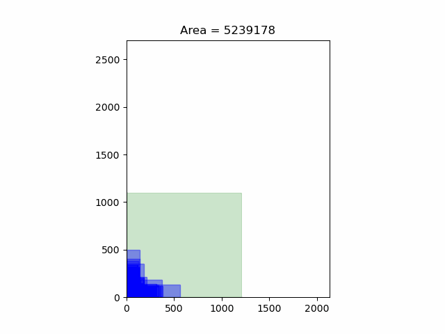
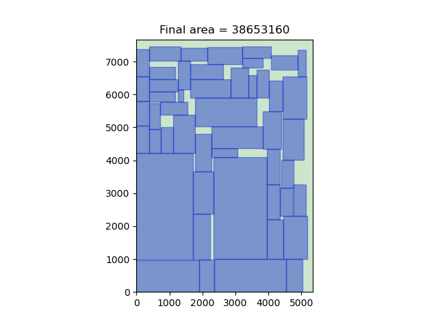

=============================
SAAF Demonstration: Floorplan
=============================

Description
===========
**Floorplanning** plays an import role in the IC modern physical design process. It is a representation of tentative placement of its major functional blocks,
and the basic objective is to minimize the total area and wire lengthi. But the constraint is that the placement of blocks needs to be non-overlapping, and 
the width and height of the floorplanning result needs to be less than the given outline. Finding optimal floorplan is a NP-hard problem, so it is suitable 
using SA to solve this kind of problem. Actually, there are many SA-based algorithms that have been proposed, and I choose the famous sequence pair [1]
representation for each packing result, and use [2] to achieve a fast evaluation. 
In thia implementation the cost function is defined as

::

    cost = α*Area + (1-α)*Wirelength

As as result, by changing the value of `α`, we can control the quality of the floorplanning result is more compact or wirelength optimized.

Execution
=========

::

  make  
  python3 floorplan [alpha] [file_name_of_block] [file_name_of_nets] [file_name_of_output]

or just use the default setting::

  make run

Result
======

* testbench: ami33

* testbench: ami49

Reference
=========
[1] `H. Murata, K. Fujiyoshi, S. Nakatake and Y. Kajitani, "Rectangle-packing-based module placement," Proceedings of IEEE International Conference on Computer Aided Design (ICCAD), 1995, pp. 472-479, doi: 10.1109/ICCAD.1995.480159.
<https://ieeexplore.ieee.org/document/480159>`__

[2] `Xiaoping Tang, Ruiqi Tian and D. F. Wong, "Fast evaluation of sequence pair in block placement by longest common subsequence computation," in IEEE Transactions on Computer-Aided Design of Integrated Circuits and Systems, vol. 20, no. 12, pp. 1406-1413, Dec. 2001, doi: 10.1109/43.969434.
<https://ieeexplore.ieee.org/document/969434>`__
