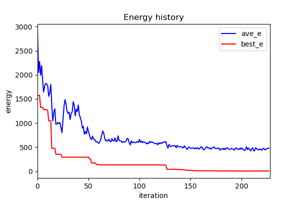

=====================================
SAAF Demonstration: Schwefel function
=====================================

Description
===========
The Schwefel function is a well-known test function fot optimization. It has several local minima, and its global minima is
located at (420.9687,...,420.9687). In this example, I use 10-dimension Schweful function to test. Try different combinations
of parameters to find the global minima.

Execution
=========

::

  make  
  make run

Result
======
::

	Iteration = 0         AG rate = 0.2     AB rate = 0.33    RB rate = 0.47    T = 100          current cost = 1705.91   best cost = 1705.91                                                                                                                           
	Iteration = 10        AG rate = 0.08    AB rate = 0.25    RB rate = 0.67    T = 81.7073      current cost = 1392.63   best cost = 883.438                                                                                                                           
	Iteration = 20        AG rate = 0.07    AB rate = 0.09    RB rate = 0.84    T = 66.7608      current cost = 716.772   best cost = 382.497                                                                                                                           
	Iteration = 30        AG rate = 0.01    AB rate = 0.07    RB rate = 0.92    T = 54.5484      current cost = 539.626   best cost = 382.497                                                                                                                           
	Iteration = 40        AG rate = 0.03    AB rate = 0.01    RB rate = 0.96    T = 44.57        current cost = 392.685   best cost = 382.497                                                                                                                           
	Iteration = 50        AG rate = 0.03    AB rate = 0.01    RB rate = 0.96    T = 36.417       current cost = 256.052   best cost = 127.448                                                                                                                           
	Iteration = 60        AG rate = 0.01    AB rate = 0.02    RB rate = 0.97    T = 29.7553      current cost = 116.768   best cost = 55.6389                                                                                                                           
	Iteration = 70        AG rate = 0.02    AB rate = 0       RB rate = 0.98    T = 24.3123      current cost = 205.444   best cost = 55.6389                                                                                                                           
	Iteration = 80        AG rate = 0.02    AB rate = 0.01    RB rate = 0.97    T = 19.8649      current cost = 63.8461   best cost = 55.6389                                                                                                                           
	Iteration = 90        AG rate = 0.03    AB rate = 0       RB rate = 0.97    T = 16.2311      current cost = 59.8239   best cost = 30.0483                                                                                                                           
	Iteration = 100       AG rate = 0.01    AB rate = 0.03    RB rate = 0.96    T = 13.262       current cost = 152.925   best cost = 30.0483                                                                                                                           
	Iteration = 110       AG rate = 0.01    AB rate = 0       RB rate = 0.99    T = 10.836       current cost = 26.9946   best cost = 26.9946                                                                                                                           
	Iteration = 120       AG rate = 0.02    AB rate = 0.01    RB rate = 0.97    T = 8.85379      current cost = 24.925    best cost = 20.2628                                                                                                                           
	Iteration = 130       AG rate = 0       AB rate = 0.03    RB rate = 0.97    T = 7.23419      current cost = 21.3043   best cost = 7.70207                                                                                                                           
	Iteration = 140       AG rate = 0       AB rate = 0.01    RB rate = 0.99    T = 5.91086      current cost = 18.6226   best cost = 7.70207                                                                                                                           
	Iteration = 150       AG rate = 0       AB rate = 0.01    RB rate = 0.99    T = 4.8296       current cost = 20.3233   best cost = 7.70207                                                                                                                           
	Iteration = 160       AG rate = 0       AB rate = 0.02    RB rate = 0.98    T = 3.94614      current cost = 25.8662   best cost = 7.70207                                                                                                                           
	Iteration = 170       AG rate = 0.01    AB rate = 0.02    RB rate = 0.97    T = 3.22428      current cost = 13.8175   best cost = 7.70207                                                                                                                           
	Iteration = 180       AG rate = 0       AB rate = 0.01    RB rate = 0.99    T = 2.63447      current cost = 20.7798   best cost = 7.70207                                                                                                                           
	Iteration = 190       AG rate = 0       AB rate = 0       RB rate = 1       T = 2.15256      current cost = 19.3208   best cost = 7.70207                                                                                                                           
	Iteration = 200       AG rate = 0.01    AB rate = 0.02    RB rate = 0.97    T = 1.75879      current cost = 11.6265   best cost = 7.58306                                                                                                                           
	Iteration = 210       AG rate = 0.01    AB rate = 0.02    RB rate = 0.97    T = 1.43706      current cost = 12.9687   best cost = 7.58306                                                                                                                           
	Iteration = 220       AG rate = 0.02    AB rate = 0.01    RB rate = 0.97    T = 1.17419      current cost = 2.66644   best cost = 2.06082                                                                                                                           
	==========Final Result==========
	+-----------------+------------+
	|Final energy     |1.89548     |
	+-----------------+------------+
	|Total iteration  |228         |
	+-----------------+------------+
	|Runtime(s)       |0           |
	+-----------------+------------+
	|Accept good rate |0.020614    |
	+-----------------+------------+
	|Accept bad rate  |0.0356579   |
	+-----------------+------------+
	|Reject bad rate  |0.943728    |
	+-----------------+------------+
	================================
	[422.0492876  420.69014571 419.41672179 420.05416349 422.42604274
	 418.74832543 421.67818514 419.36421871 421.44807159 421.38886246]    

