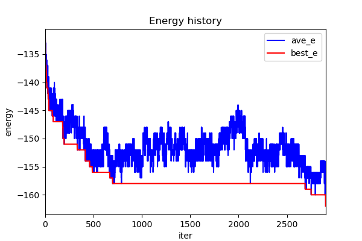

=================================
SAAF Demonstration: Sudoku solver
=================================

Description
===========
**Sudoku** is a well known number-placement puzzle, and there are a lot of algorithms that can solve sudoku pretty fast. In this demonstration, I
just want to show that once you can define which state is better for the problem, than we may apply SAAF to solve it. It is definitely not the fatest 
way, but it can solve very kind of problems like this once you can apply to this framework.

Execution
=========

::

  make  
  python3 main.py [testbench]

or just use the default setting::

  make run

Result
======

::

	Initial sudoku:
	=========================
	| 5 9   |   1   | 3   6 |
	|   3   |       | 7 1   |
	|   1 8 | 3     | 5     |
	=========================
	|     7 | 9   5 | 4     |
	|     9 | 2   4 | 6     |
	|     4 | 1   6 | 9     |
	=========================
	|     1 |     3 | 2 4   |
	|   6 5 |       |   3   |
	| 9   3 |   2   |   6 5 |
	=========================

	Iteration = 0         AG rate = 1       AB rate = 0       RB rate = 0       T = 0.5          current cost = -132      best cost = -132      
	Iteration = 1000      AG rate = 0       AB rate = 0       RB rate = 1       T = 0.495025     current cost = -157      best cost = -158      
	Iteration = 2000      AG rate = 0       AB rate = 0       RB rate = 1       T = 0.490099     current cost = -148      best cost = -158      

	Solved sudoku:
	=========================
	| 5 9 2 | 4 1 7 | 3 8 6 |
	| 4 3 6 | 5 9 8 | 7 1 2 |
	| 7 1 8 | 3 6 2 | 5 9 4 |
	=========================
	| 6 8 7 | 9 3 5 | 4 2 1 |
	| 1 5 9 | 2 8 4 | 6 7 3 |
	| 3 2 4 | 1 7 6 | 9 5 8 |
	=========================
	| 8 7 1 | 6 5 3 | 2 4 9 |
	| 2 6 5 | 8 4 9 | 1 3 7 |
	| 9 4 3 | 7 2 1 | 8 6 5 |
	=========================

Reference
=========
[1] `SudokuSolver 
<https://github.com/erichowens/SudokuSolver>`__

